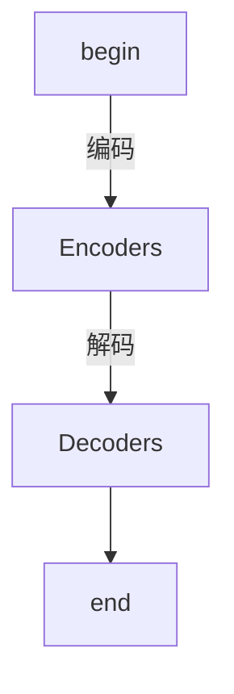
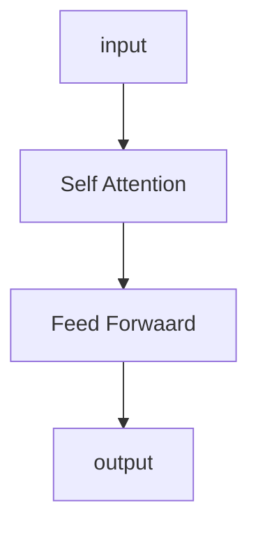
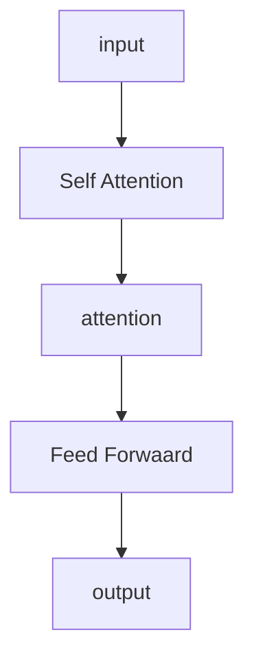

# 
Transformer机制
### 简介
组成部分：Encoder和Decoder

其中，Encoders是编码器，Decoders是解码器，各自包含6个小的编码/解码器

### Encoder（编码器）
结构：包含两个部分——Self Attention & Feed Forward

#### Self Attention
流程：

1. 将输入的向量乘上三个不同的矩阵，得到三个不同的向量，即权重矩阵。重复两次次操作，分别记矩阵为$Q_1,K_1,V_1;Q_2,K_2,V_2$

    （目的：增加参数，提高模型效果）

2. 计算得分。将上述得到的两个矩阵进行点乘运算得到得分,即${Q_1}\cdot{K_1}$ , ${Q_1}\cdot{K_2}$

3. 将步骤2中得到的得分处于K向量维度的平方根
（目的：是梯度更加稳定）

4. 运用softmax进行标准化，其和为1

5. 将V向量乘上步骤4得到的数值，得到矩阵$Z_1$,$Z_2$

   （目的：忽略相关度较低的部分）

6. 将$Z_1$和$Z_2$相加得到矩阵Z

7. 如果有多个权重矩阵Q/K/V，得到多个权重矩阵$Z_1,Z_2,…,Z_n$，拼接之后乘以一个额外的权重矩阵，得到Z，即为self attention 的输出

公式：$Z=softmax(\frac{Q\times {K}}{\sqrt d_k})\times V$

#### 在Encoders和Decoders中，运用了残差网络结构，包含self attention 的输出和原始的输入

#### Feed Forward
目的：把数据变成高维度之后转换成低维度，以提取深层次的特征

方式：线性变换

### Decoders（解码器）

