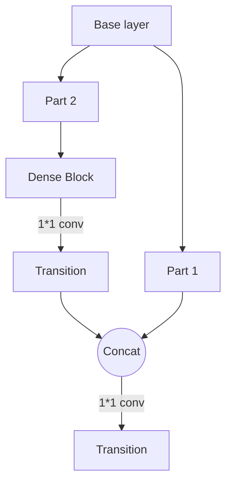

# 
YOLO模型
### 模型概述
优势：计算速度较快、精度高

劣势：对数据数量要求较大、有图片尺寸限制

作用：可以预测类别标签、检测对象位置

对于一张图片，里面包含很多个物体，每个物体信息包括他的中心位置（x,y），高（h），宽（w）和它的类别，共5个信息

### 模型结构
#### Backbone
例子：AlexNet Resnet VGG等

运用CSPDarknet53网络结构=CSP网络结构+Darknet53

目的：提取图像特征，便于后续的处理和分析

CSPDesnet的结构

#### Neck
例子：卷积层、池化层等

目的：对特征进行降维/调整

#### Head
本质：分类器或者回归器

例子：全连接层、池化层、softmax层、sigmoid层等